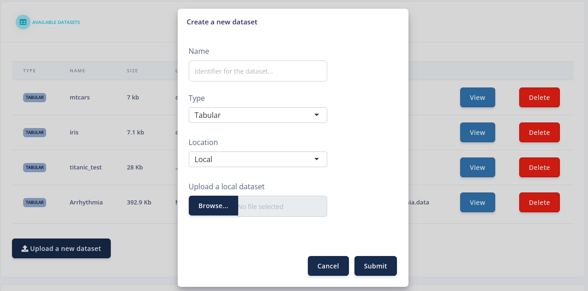
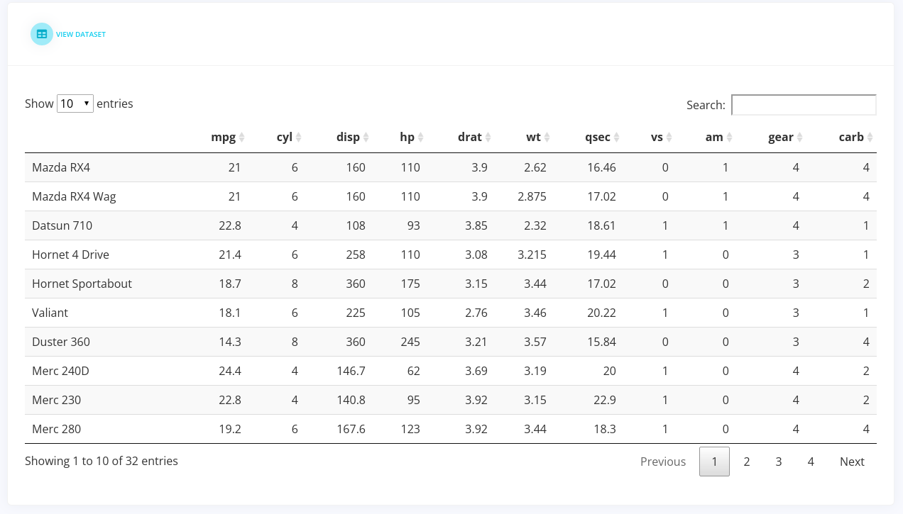

<!-- README.md is generated from README.Rmd. Please edit that file -->

# dataviewer

<!-- badges: start -->

[](https://lifecycle.r-lib.org/articles/stages.html#experimental)
[](https://github.com/adamwaring/dataviewer/actions)
[](https://codecov.io/gh/adamwaring/dataviewer?branch=master)
<!-- badges: end -->

This app contains the components for a data input and viewer module for
an app.

## Installation

You can install the development version from
[GitHub](https://github.com/) with:

``` r
# install.packages("devtools")
devtools::install_github("adamwaring/dataviewer")
```

## Example

The available datasets are listed in a table with some summary
information. These can be deleted by selecting the delete button.


New datasets can also be uploaded. Clicking the button launches a
dataset input modal.



By clicking on the view button next to datasets they are rendered as
DataTables.


